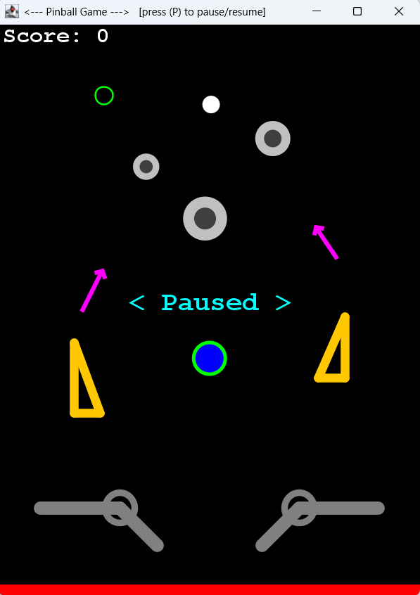

# 2d-pinball-game

### Overview
This is a minimal 2D pinball game built in Java. 

### Project Structure
* GameFrame.java: Sets up window size, close operation and adds the game panel. 
* GamePanel.java: Contains input listeners, game loop, paint component. 
* Ball.java/Bumper.java/Slingshot.java/Flipper.java: Classes for pinball objects (containing methods for movement, collision handling, rendering). 
* Vector2D.java: Class for 2D vector operations. 

### How to Run
Clone the repository into your Eclipse workspace. \
Right‐click the project and select "Run As" > "1 Java Application". \
The pinball window will open automatically. 

### Controls
|Key|Action|
|---|------|
|Left Arrow|Control left flipper|
|Right Arrow|Control right flipper|
|P|Pause or resume the game|
|R|Restart when on the game over screen|

### Gameplay Features
* Ball movement with basic physics. 
* Bumpers and slingshots that reflect the ball. 
* Flippers controlled by arrow keys. 
* Score on the top‐left corner. 
* Pause/resume functionality with visual overlay. 
* Game over state with option to restart. 

### Scoring & Game Over
Each bumper hit awards 1 point. \
When the ball falls below the bottom edge the game is over. 

### Acknowledgments
Microsoft Copilot for code suggestions. 

